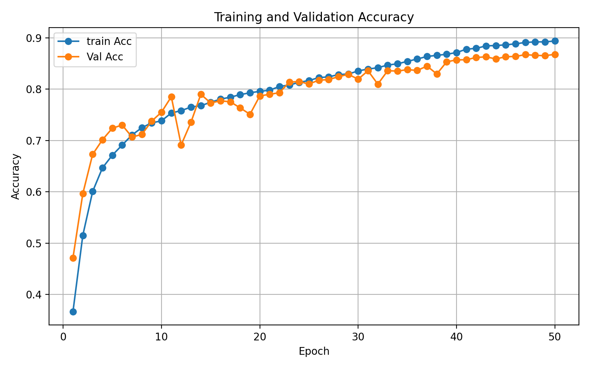
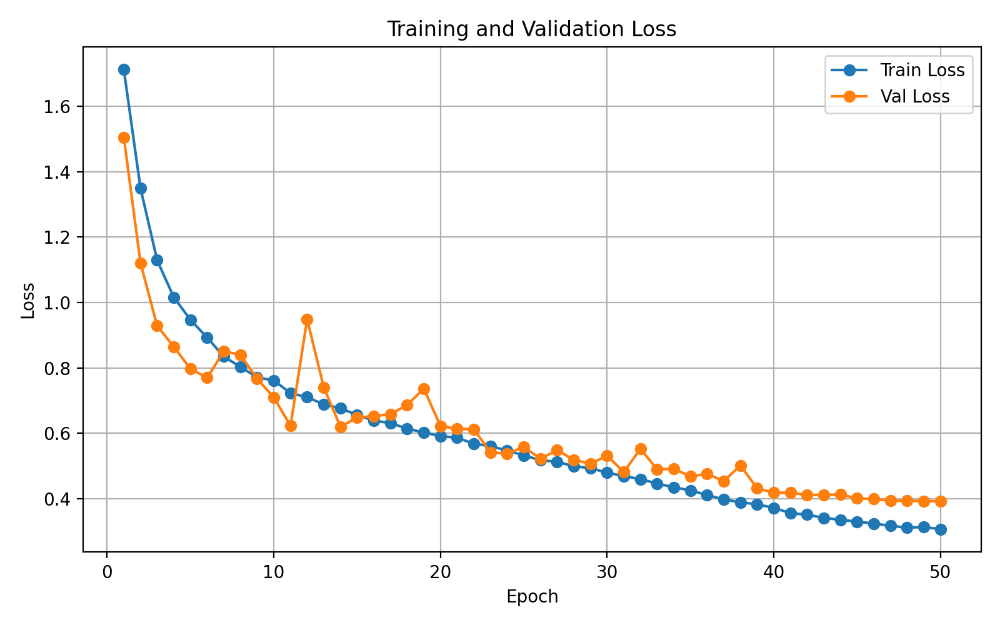
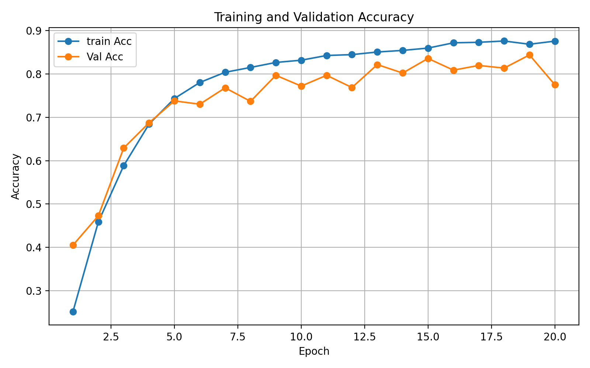
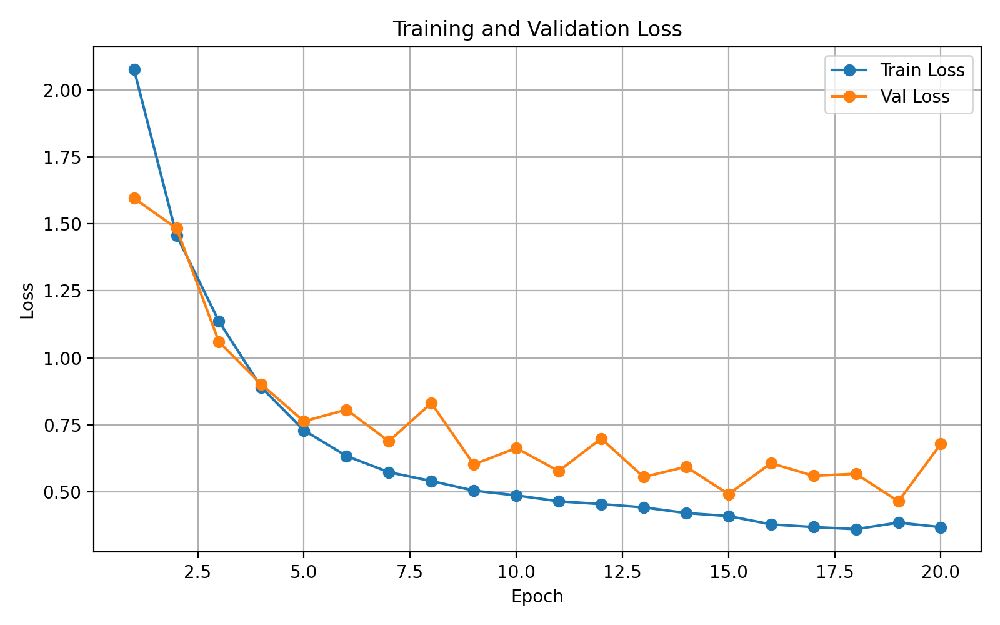
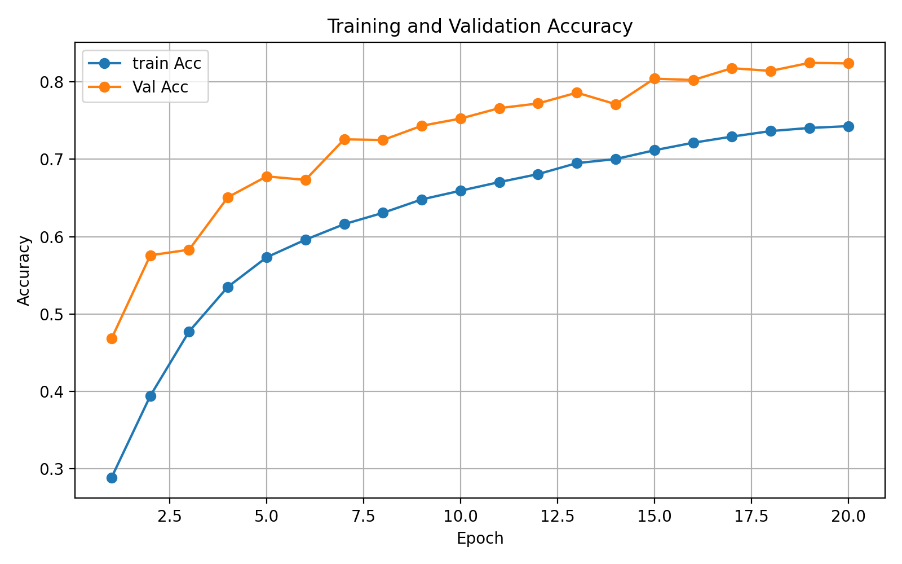
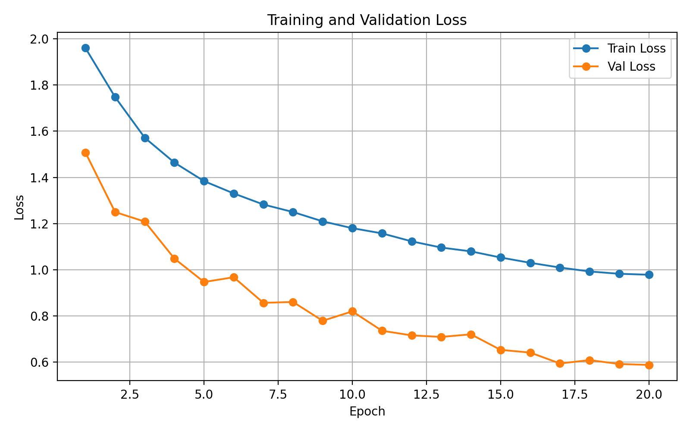
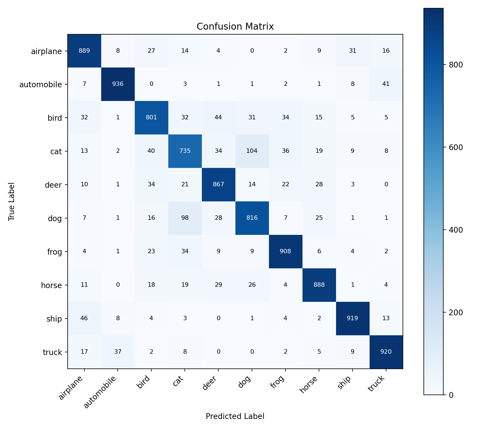

# 🚀 CIFAR-10 图像分类训练 Pipeline 与实验分析

这个项目是一个基于 **PyTorch** 的 CIFAR-10 图像分类训练与评估 Pipeline。它不只是在数据集上训练一个模型，而是完整覆盖了机器学习实验中常见的工程闭环：配置管理、训练恢复、消融实验、指标记录、曲线分析、混淆矩阵、错误样本分析和数据质量评估。

项目最终目标是把一个普通 CIFAR-10 分类任务，整理成可以写进简历、可以被复现、可以被解释的机器学习工程项目。

## ✨ Highlights

- **YAML 配置驱动实验**：统一管理模型、优化器、scheduler、数据增强、label noise 等参数。
- **完整训练 Pipeline**：支持 SimpleCNN / ResNet18、SGD / Adam、StepLR / CosineAnnealingLR。
- **Checkpoint 与断点恢复**：保存 `best.pt` / `last.pt`，支持从中断 epoch 继续训练。
- **实验对比完整**：覆盖优化器、学习率策略、数据增强、模型容量和标签噪声。
- **可解释评估**：输出 loss/accuracy 曲线、confusion matrix、per-class accuracy、bad cases。
- **数据质量分析**：通过 10% label noise 实验量化噪声标签对泛化能力的影响。

## 🧱 Project Structure

```text
.
├── configs/                  # YAML 实验配置
│   ├── simple_cnn_baseline.yaml
│   ├── simple_cnn_adam.yaml
│   ├── simple_cnn_step.yaml
│   ├── simple_cnn_cosine.yaml
│   ├── simple_cnn_label_noise_10.yaml
│   └── resnet18.yaml
├── data/                     # CIFAR-10 数据加载、数据增强、标签噪声注入
├── models/                   # SimpleCNN / ResNet18
├── engine/                   # 训练、验证、checkpoint
├── analysis/                 # 曲线、混淆矩阵、badcase 分析
├── docs/
│   ├── assets/               # README/report 展示图片
│   └── resume_snippet.md     # 简历可复制版本
├── results/
│   └── experiments_summary.csv
├── outputs/                  # 本地原始实验输出，默认被 .gitignore 忽略
├── train.py
├── evaluate.py
├── report.md
└── README.md
```

## 🏁 Quick Start

安装依赖：

```bash
pip install -r requirements.txt
```

训练最优 SimpleCNN 配置：

```bash
python train.py --config configs/simple_cnn_cosine.yaml
```

运行 10% 标签噪声实验：

```bash
python train.py --config configs/simple_cnn_label_noise_10.yaml
```

评估 checkpoint：

```bash
python evaluate.py --checkpoint outputs/simple_cnn_cosine_20260601_125946/best.pt --num-workers 0
```

从中断处继续训练：

```bash
python train.py --config configs/resnet18.yaml --resume outputs/resnet18_cosine_20260601_172941/last.pt
```

## 📊 Experiment Summary

完整 CSV 结果见 [results/experiments_summary.csv](results/experiments_summary.csv)，详细分析见 [report.md](report.md)。

| Experiment | Model | Key Setting | Best Val Acc | Last Train Acc | Last Val Acc | Gap |
| --- | --- | --- | ---: | ---: | ---: | ---: |
| SimpleCNN Baseline | SimpleCNN | SGD, no aug, no scheduler | 79.33% | 88.27% | 76.60% | 11.67% |
| SimpleCNN + Aug | SimpleCNN | SGD, aug, no scheduler | 78.43% | 78.47% | 76.70% | 1.77% |
| SimpleCNN + Adam | SimpleCNN | Adam, no aug | 79.48% | 92.26% | 78.90% | 13.36% |
| SimpleCNN + StepLR | SimpleCNN | SGD + StepLR | 81.80% | 95.43% | 81.53% | 13.90% |
| **SimpleCNN + CosineLR** | SimpleCNN | Aug + CosineLR | **86.79%** | 89.38% | 86.79% | **2.59%** |
| ResNet18 + CosineLR | ResNet18 | Aug + CosineLR | 84.41% | 87.60% | 77.53% | 10.07% |
| SimpleCNN + 10% Label Noise | SimpleCNN | Aug + CosineLR + noisy labels | 82.45% | 74.27% | 82.38% | -8.11% |

核心结论：**数据增强 + CosineAnnealingLR** 是当前配置下最稳的组合，最佳验证准确率达到 **86.79%**，同时最终 train-val gap 只有 **2.59%**。

## 📈 Training Curves

### Best Run: SimpleCNN + CosineLR





### Model Capacity: ResNet18





### Data Quality: 10% Label Noise





## 🧭 Confusion Matrix & Error Patterns

最优模型的 confusion matrix：



主要混淆来自低分辨率下外观相似的类别：

| True | Pred | Count |
| --- | --- | ---: |
| automobile | truck | 13 |
| dog | cat | 13 |
| ship | airplane | 12 |
| frog | cat | 9 |
| truck | automobile | 9 |
| deer | horse | 7 |

示例 bad cases：

| automobile → truck | dog → cat | ship → airplane | deer → horse |
| --- | --- | --- | --- |
|  |  |  |  |

这些错误样本说明，模型在 32x32 低分辨率图像中容易受到主体轮廓、背景纹理和细粒度类别相似性的影响。

## 🧪 Analysis Commands

生成训练曲线：

```bash
python analysis/plot_curves.py --metrics outputs/simple_cnn_cosine_20260601_125946/metrics.csv
```

生成混淆矩阵：

```bash
python analysis/confusion_matrix.py --checkpoint outputs/simple_cnn_cosine_20260601_125946/best.pt --num-workers 0
```

导出错误样本：

```bash
python analysis/badcase_analysis.py --checkpoint outputs/simple_cnn_cosine_20260601_125946/best.pt --num-workers 0
```

## 🎯 Resume Value

这个项目可以在简历中强调三点：

- **训练工程能力**：配置化实验、checkpoint、断点恢复、日志记录。
- **实验分析能力**：消融实验、train-val gap、曲线分析、scheduler 对比。
- **模型评估能力**：confusion matrix、per-class metrics、badcase、label noise 数据质量实验。

可直接复制的中英文简历话术见 [docs/resume_snippet.md](docs/resume_snippet.md)。

